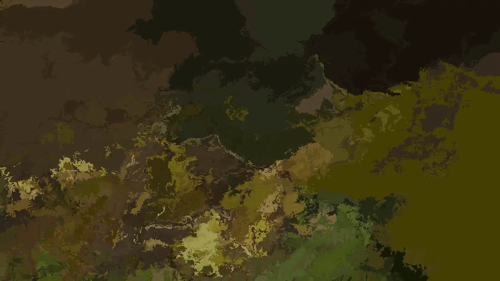

# Transflow

Set of tools for transferring optical flow from one media to another.

This tool extracts [optical flow](https://en.wikipedia.org/wiki/Optical_flow) as a dense velocity field from a video input (file or stream) and applies it to an image, a video file or stream, for creative purposes. Multiple techniques can be used, various parameters can be tuned to precisely craft visual effects directly from raw raster data. Here is how it looks (click to view in full resolution):

Flow Source | Pixmap Source | Result
----------- | ------------- | ------
[](assets/River.mp4) | [](assets/Deer.jpg) | [](out/ExampleResetRandom.mp4)

## Getting Started

### Prerequisites

You'll need a working installation of [Python 3](https://www.python.org/). You'll also need [FFmpeg](https://ffmpeg.org/) binaries, available in `PATH`, the `ffmpeg -version` command should work.

### Basic Installation

The process should be straightforward.

1. Download the [latest release](https://github.com/ychalier/transflow/releases)
2. Install it with `pip`:
   ```console
   pip install ~/Downloads/transflow-1.11.0.tar.gz
   ```

### Alternative Installation

If you want to access the code.

1. Clone or [download](https://github.com/ychalier/transflow/archive/refs/heads/main.zip) this repository:
   ```console
   git clone https://github.com/ychalier/transflow.git
   cd transflow
   ```
2. Install requirements:
   ```console
   pip install -r requirements.txt
   ```

### Usage

The alias `transflow` represents either `python -m transflow` or `python transflow.py`, depending on the chosen installation method.
The simplest process consists in taking the motion from a video file and applying it to an image:

```console
transflow flow.mp4 -p image.jpg -o output.mp4
```

If your are not too familiar with the command line, you can use the graphical user interface (GUI) to set parameters interactively. You can run the GUI with:

```console
transflow gui
```

For more details, see [USAGE.md](USAGE.md).

## [Examples](USAGE.md#examples)

### [Basic Transfer](USAGE.md#basic-transfer)

```console
transflow assets/River.mp4 -p assets/Deer.jpg -Oo out/ExampleBasic.mp4
```



### [Random Reset](USAGE.md#random-reset)

```console
transflow assets/River.mp4 -d forward -p assets/Frame.png -r random 0.5 -m assets/Mask.png -Oo out/ExampleResetRandom.mp4
```


### [Progressive Introduction](USAGE.md#progressive-introduction)

```console
transflow assets/Train.mp4 -p assets/Train.mp4 -i border-right:1 -l 0 introduction --background black -Oo out/ExampleIntroduction.mp4"
```


#### [Sticky Texture](USAGE.md#sticky-texture)

```console
transflow assets/Train.mp4 -p assets/Train.mp4 -p assets/Frame.png 1 -l 0 static -l1 -e -Oo out/ExampleStickyTexture.mp4
```


## Additional Resources

This repository also contains two other versions of this program:

- in the [extra/cpp](extra/cpp) folder, a C++ version using OpenCV to transfer the flow from one webcam to another,
- in the [extra/www](extra/www) folder, a WebGL version that emulates the effect in a web browser; a version is hosted on [chalier.fr/transflow](https://chalier.fr/transflow/).

There are also other modules (in the [extra](extra) folder):

- [viewflow](extra/viewflow), for visualizing and inspecting optical flow in a video player setting,
- [control](extra/control.py), for generating alteration images (see [Pixmap Alteration](USAGE.md#pixmap-alteration)). 

## Contributing

Contributions are welcomed. Do not hesitate to submit a pull request with your changes! Submit bug reports and feature suggestions in the [issue tracker](https://github.com/ychalier/transflow/issues/new/choose).

## License

This project is licensed under the GPL-3.0 license.
