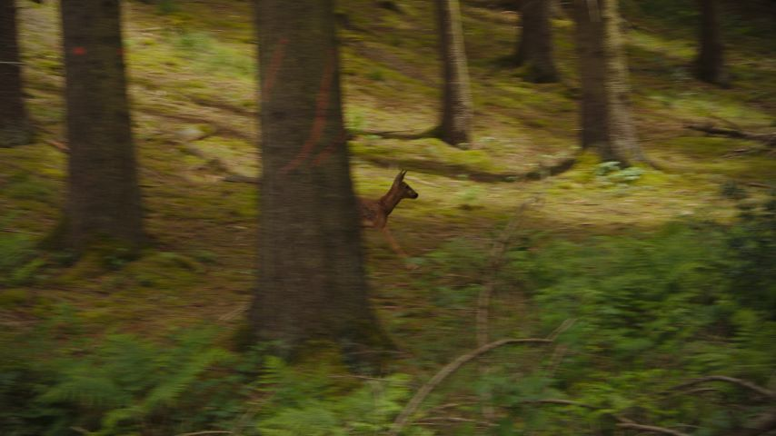
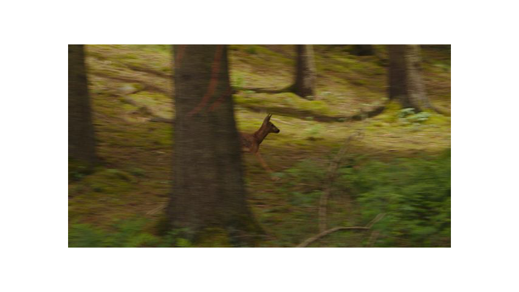
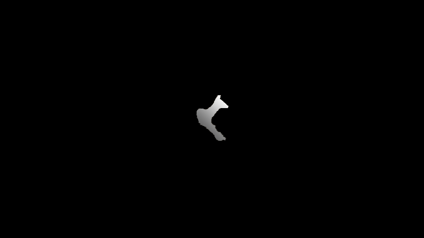

# Transflow Reference Guide

This document provides details on how to use the `transflow` module for performing various effects based on optical flow transfer.

## Contents

- [Basic Flow Transfer](#basic-flow-transfer)
- [Detailed Example](#detailed-example)
- [Flow Estimation Methods](#flow-estimation-methods)
- [Using Motion Vectors](#using-motion-vectors)
- [Flow Direction](#flow-direction)
- [Flow Preprocessing](#flow-preprocessing)
- [Flow Transformations](#flow-transformations)
- [Multiple Flow Sources](#multiple-flow-sources)
- [Accumulation Methods](#accumulation-methods)
- [Accumulator Heatmap](#accumulator-heatmap)
- [Accumulator Visualization](#accumulator-visualization)
- [Resetting Accumulator](#resetting-accumulator)
- [Generative Bitmap Sources](#generative-bitmap-sources)
- [Webcam Sources](#webcam-sources)
- [Bitmap Alteration](#bitmap-alteration)
- [Live Visualization](#live-visualization)
- [Interrupting Processing](#interrupting-processing)
- [Restart From Checkpoint](#restart-from-checkpoint)
- [Seek, Duration and Repeat](#seek-duration-and-repeat)

## Basic Flow Transfer

The simplest process consists in taking the motion from a video file and applying it to an image:

```console
transflow flow.mp4 -b image.jpg -o output.mp4
```

The first argument `flow.mp4` is the video to extract the optical flow from. The `-b, --bitmap` argument specifies the "bitmap" source to apply the flow to, an image in this case. The `-o, --output` argument specifies the path to the output video. The output video will match the framerate and duration of the flow source (minus the first frame, as computation requires two frames). When done, the output file is automatically opened, unless the `-nx, --no-execute` flag is passed.

**Video Bitmap Source.** If the bitmap source is a video, the output will halt when the first source is exhausted. Output framerate is determined by the flow source, hence you might want to make sure both sources have matching framerates. FFmpeg's [fps filter](https://trac.ffmpeg.org/wiki/ChangingFrameRate) will help you with that.

**Dimensions.** Flow and bitmap sources should have the same dimensions. Again, FFmpeg's [scale filter](https://trac.ffmpeg.org/wiki/Scaling) will help you with that. If the flow source is smaller than the bitmap source by an integer factor, it is scaled accordingly. Thus, a 320x180 video can be used as a flow source for a 1920x1080 bitmap. Non-integer scaling is not supported. The bitmap can not be smaller than the flow.

**Output Filename.** Unless the `-re, --replace` flag is passed, the program automatically generates unique filenames to output files to avoid naming conflicts, by adding a numerical suffix.

**Output Format.** Output codec can be specified with the `-vc, --vcodec` argument. Default value is `h264`. Possible values can be listed with the `ffmpeg -codecs` command.

## Detailed Example

Flow Source | Bitmap Source | Result
----------- | ------------- | ------
[River.mp4](assets/River.mp4) | [Deer.jpg](assets/Deer.jpg) | [Output.mp4](out/ExampleDeer.mp4)
[](assets/River.mp4) | [](assets/Deer.jpg) | [](out/ExampleDeer.mp4)

The first step is to use a graphic editor to add a white frame around the deer. This creates the erasing effect when the white pixels move onto the colored ones.

With the editor, create a new image where you cut out the deer, color it white, and color everything else black. This will create the reset mask: while all pixels will get displaced, the pixels forming the deer will get healed again and again. Applying a linear gradient can be used to make the head more resilient than the body.

Modified Bitmap Source | Reset Mask
---------------------- | ----------
[Frame.png](assets/Frame.png) | [Mask.png](assets/Mask.png)
[](assets/Frame.png) | [](assets/Mask.png)

Then, all you need is this one command (assuming input files are in the [assets](assets) folder, as in the basic repository structure):

```console
transflow assets/River.mp4 -d forward -b assets/Frame.png -rm random -rk assets/Mask.png -ha 0:0:0:0 -o Output.mp4
```

- The first argument is the flow source, the river video.
- The `-d` argument switches flow direction to `forward`, for a more grainy result (see [Flow Direction](#flow-direction) section). 
- The `-b` argument specifies the bitmap source, the deer image with the white frame.
- The `-rm` argument specifies the reset method to random (see [Resetting Accumulator](#resetting-accumulator) section).
- The `-rk` argument specifies the path to the mask image created: the brightest its pixels are, the more likely they will heal.
- The `-ha` argument is required for the effect to work. It forces the heatmap to be always zero, ensuring the reset effect occurs everywhere everytime (see [Accumulator Heatmap](#accumulator-heatmap) section).

A final detail could be to control the flow scale to ease the start and the end, and add a peak flow time. This can be achieved with the `-ff` argument (see [Flow Filters](#flow-filters) section). Simply add the following to the above command:

```console
-ff "scale=max(0, -.0000061191*t**5+.0003680860*t**4-.0075620960*t**3+.0609758832*t**2-.0717236701*t+.0079797631)"
```

The formula is based on time `t`. The river video lasts for about 30 seconds. Such formulas can be obtained via [Lagrange interpolation](https://en.wikipedia.org/wiki/Lagrange_polynomial), I published a hacky tool for that, the [Online Lagrange Polynomial Editor](https://chalier.fr/lagrange/):

[](https://chalier.fr/lagrange/)

## Flow Estimation Methods

By default, Optical flow extraction relies on [OpenCV](https://opencv.org/)'s implementation of [Gunnar Farneback's algorithm](#gunnar-farnebäck). Other methods can be used, such as [Lukas-Kanade](#lukas-kanade) or [Horn-Schunck](#horn-schunck). To use a different method or change their parameters, the path to a JSON configuration file can be passed with the `-cc, --cv-config` argument. If the keyword `window` is passed to this argument, a [Qt](https://pypi.org/project/PySide6/) window shows up to tune parameters live, which combines nicely with [live visualization](#live-visualization).

> [!NOTE]
> On Linux, you may have to install the `libxcb-cursor0` package for the Qt window to work.

You may find sample config files in the [configs](configs) folder. They follow the following format:

```json
{
    "method": "farneback",
    "fb_pyr_scale": 0.5,
    "fb_levels": 3,
    "fb_winsize": 15,
    "fb_iterations": 3,
    "fb_poly_n": 5,
    "fb_poly_sigma": 1.2
}
```

### Gunnar Farnebäck

Default method, fast, precise. Uses [OpenCV implementation](https://docs.opencv.org/3.4/d4/dee/tutorial_optical_flow.html#:~:text=Dense%20Optical%20Flow%20in%20OpenCV). To use it, add the `"method": "farneback"` attribute in the config file.

Parameter | Default | Description
--------- | ------- | -----------
`fb_pyr_scale` | 0.5 | the image scale (<1) to build pyramids for each image; pyr_scale=0.5 means a classical pyramid, where each next layer is twice smaller than the previous one
`fb_levels` | 3 | number of pyramid layers including the initial image; levels=1 means that no extra layers are created and only the original images are used
`fb_winsize` | 15 | averaging window size; larger values increase the algorithm robustness to image noise and give more chances for fast motion detection, but yield more blurred motion field
`fb_iterations` | 3 | number of iterations the algorithm does at each pyramid level
`fb_poly_n` | 5 | size of the pixel neighborhood used to find polynomial expansion in each pixel; larger values mean that the image will be approximated with smoother surfaces, yielding more robust algorithm and more blurred motion field, typically poly_n =5 or 7
`fb_poly_sigma` | 1.2 | standard deviation of the Gaussian that is used to smooth derivatives used as a basis for the polynomial expansion; for poly_n=5, you can set poly_sigma=1.1, for poly_n=7, a good value would be poly_sigma=1.5

### Horn-Schunck

Slow, grainy (unless letting the algorithm converge, which is very slow). Custom implementation of the [Horn-Schunck method](https://en.wikipedia.org/wiki/Horn%E2%80%93Schunck_method). To use it, add the `"method": "horn-schunck"` attribute in the config file.

Parameter | Default | Description
--------- | ------- | -----------
`hs_alpha` | 1 | regularization constant; larger values lead to smoother flow
`hs_iterations` | 3 | maximum number of iterations the algorithm does; may stop earlier if convergence is achieved (see `hs_delta` parameter); large value (>100) required for precise computations
`hs_decay` | 0 | initial flow estimation (before any iteration) is based on previous flow scaled by hs_decay; set hs_decay=0 for no initialization; set hs_decay=1 for re-using whole previous flow; set hs_decay=0.95 for a geometric decay; using hs_decay>0 introduces an inertia effect
`hs_delta` | 1 | convergence threshold; stops when the L2 norm of the difference of the flows between two consecutive iterations drops below

### Lukas-Kanade

Slow if dense, (really) fast if sparse. Adapted from [OpenCV implementation](https://docs.opencv.org/3.4/d4/dee/tutorial_optical_flow.html#:~:text=Lucas-Kanade%20Optical%20Flow%20in%20OpenCV). To use it, add the `"method": "lukas-kanade"` attribute in the config file.

> [!TIP]
> Normally, Lukas-Kanade only computes optical flow for a fixed set of points. To obtain a dense field, we simply pass every pixel as a target, which is slow. Performance can balanced with sparsity, by only computing the flow one every 2/3/4/… pixel and broadcasting the result to the whole macroblock. To do this, see the `lk_step` parameter.

Parameter | Default | Description
--------- | ------- | -----------
`lk_window_size` | 15 | size of the search window at each pyramid level
`lk_max_level` | 2 | 0-based maximal pyramid level number; if set to 0, pyramids are not used (single level), if set to 1, two levels are used, and so on; if pyramids are passed to input then algorithm will use as many levels as pyramids have but no more than maxLevel
`lk_step` | 1 | size of macroblocks for estimating the flow; set lk_step=1 for a dense flow; set lk_step=16 for 16*16 macroblocks

## Using Motion Vectors

To fasten computation, you can use H264 motion vectors as a flow field. For this, you have to set the `-mv, --use-mvs` flag, and the video must be encoded in a specific way, to make sure frames are encoded relative to the previous frame only. Using FFmpeg, this can be achieved with the following command:

```console
ffmpeg -i input.mp4 -refs 1 -bf 0 -g 9999 output.mp4 
```

- `-refs 1` forces only one parent per frame
- `-bf 0` removes any B frame (frames predicted from the future)
- `-g 9999` reduces the amount of I-frames (reference frames) in the video

> [!NOTE]
> Using motion vectors this way can only produce a forward flow (see [Flow Direction](#flow-direction) section).

## Flow Direction

OpenCV optical flow computation follows the following equation (where $I$ is the intensity):

$$I[x, y, t] = I[x + dx, y + dy, t + dt]$$

This is **forward** flow computation, ie. we known where to move pixels from the past frame to rebuild the next frame. This causes various issues: displacements must be rounded, and conflicts must be arbitrarily solved when a pixel leaves its place or when two collide.

Therefore, by default, the program uses **backward** flow computation, ie. computes the flow from the next frame to the previous frame, ie. solving:

$$I[x, y, t + dt] = I[x + dx, y + dy, t]$$

This way, we compute the origin for every pixel in the next frame, solving most of the issues. Results look cleaner, more continuous, with backward flow. Forward flow looks more grainy, more dirty.

You can specify the flow direction you want with `-d, --direction {forward,backward}`. If nothing is specified, `backward` is the default. If using motion vectors as flow source, then the direction will be forced to `forward`.

> [!NOTE]
> Forward direction is not compatible with the sum accumulator (see [Accumulation Methods](#accumulation-methods) section). 

## Flow Preprocessing

By adding the `-ef, --export-flow` flag, the program will save the extracted optical flow to a file with the `.flow.zip` extension. This file can later be used as a flow source, instead of a video file:

```console
transflow myvideo.flow.zip -b image.jpg -o output.mp4
```

If the `-rf, --round-flow` argument is specified, the output flow will be integers instead of floats. This greatly reduces file size and processing speed, at the cost of quantization artefacts.

## Flow Transformations

### Flow Filters

The flow matrix can be modified by applying several filters, with the `-ff, --flow-filters` argument. You may specify a filter with the syntax `name=arg1:arg2:arg3:…`. Mulitple filters can be specified, simply separate them with a semicolon `;`.

Filter | Arguments | Description
------ | --------- | -----------
`scale` | `float` or Time-based expression | Multiply the whole matrix with a value
`threshold` | `float` or Time-based expression | Every flow vector with a magnitude below the threshold (in pixels) is set to 0
`clip` | `float` or Time-based expression | Every flow vector with a magnitude above the threshold (in pixels) is scaled to this maximum magnitude

For instance, the argument `-ff scale=2;clip=5` will multiply the flow by 2 and scale down vectors with magnitude greater than 5 pixels.

Time-based expression means that instead of a floating constant, you can pass a Pythonic expression based on the variable `t` that will be evaluated at runtime by replacing `t` with the current frame timestamp in seconds. Python's [`math`](https://docs.python.org/3/library/math.html) is available when evaluating the expression. For instance, `-ff "scale=1-math.exp(-.5*t)"` can be used to fake a slow start in the first seconds.

> [!NOTE]
> The magnitude of flow vectors is computed as their L2 norm. Values are in pixels.

### Applying A Mask

You can pass the path to an image file with the `-fm, --flow-mask`. The image luminance will be scaled between 0 (black) and 1 (white) and multiplied element-wise to the flow array.

### Flow Convolution Kernel

Flow can be filtered with convolution kernels by specifying the path to a kernel file with the `-fk, --flow-kernel` argument. A kernel file is a [NumPy export](https://numpy.org/doc/stable/reference/generated/numpy.save.html) of an [`ndarray`](https://numpy.org/doc/stable/reference/generated/numpy.ndarray.html#numpy-ndarray), in NumPy `.npy` format. For instance, the following script generates a basic blur filter:

```python
import numpy
numpy.save("blur.npy", numpy.ones((3, 3)) / 9)
```

The script [kernels.py](kernels.py) can be used to generate basic kernels.

## Multiple Flow Sources

Multiple flow sources can be specified and merged. A first source must be specified as the first positional argument, as usually, and will be used to determine defaults metrics such as output framerate. Extra flow sources can be specified using the `-f, --extra-flow` argument. You may provide one or more paths to valid flow inputs (video files, preprocessed archives, webcam indices). For each pair of frame, flows from all sources will be merged according to the operation specified with the `-sm, --flows-merging-function` argument, which, by default, is the sum.

Mergin Function | Description
--------------- | -----------
`absmax`        | Take the greatest (in magnitude) values accross flows
`average`       | Scaled sum of all flows
`difference`    | Take the difference between the first flow and the sum of the others
`first`         | Only return the first flow (for debugging)
`maskbin`       | Multiply the first flow by others where values are mapped to either 0 (no movement) or 1 (some movement) – for reference, a threshold of 0.2 pixel in magnitude is used as threshold
`masklin`       | Multiply the first flow by others where values are converted to absolute values (so they serve as scaling factors)
`product`       | Product of all flows
`sum`           | Sum of all flows (default)

## Accumulation Methods

Flow are accumulated accross time. You can specify the accumulation method with the `-m, --acc-method` argument. Possible values are `map` (default), `sum`, `stack`, `crumble` or `canvas`. The accumulator is in charge of transforming frames from the bitmap source.

Method | Description | Example
------ | ----------- | -------
`map`  | Flows are applied to a quantized UV map. Looks grainy. | 
`sum`  | Flows (backward only, see [Flow Direction](#flow-direction) section) are summed in a floating array. Looks smooth.| 
`stack` | Pixels are considered as particles moving on a grid. Computation is VERY slow.| 
`crumble` | Moved pixels leave an empty spot behind them.| 
`canvas` | Paste moving pixels from the bitmap to a canvas, and applying the flow on the canvas | 

**Background Color.** `stack` and `crumble` accumulator can contain empty spots, which are assigned a background color set with the `-ab, --accumulator-background` argument (white by default). If provided, the color must be expressed as an HEX value. For instance, for a green chroma key, one may use the `-ab 00ff00` argument.

**Stack Parameters.** An empty cell has a color defined by the . A non-empty cell has a color determined by the function passed to the `-sc, --stack-composer` argument. Possible values are:
- `top`: color of the last arrived pixel (default)
- `add`: all pixels in stack are summed, value is clipped
- `sub`: subtractive composition, as in painting
- `avg`: average all pixels in stack

**Canvas Parameters.** The canvas accumulator has potential for generalizing a lot of features, though it is not ready yet. So far, you may specify the following arguments:

Argument | Default | Description
-------- | ------- | -----------
`-ic, --initial-canvas` | White | Either a HEX color or a path to an image. Will define the initial canvas image.
`-bm, --bitmap-mask` | `None` | (Optionnal) A path to a black and white image. If set, only bitmap pixels from white regions in the mask will be introduced, otherwise, every moving bitmap pixels are considered.
`-bi, --bitmap-introduction-flags` | 1 | If 1, moving bitmap pixels are pasted onto the canvas. If 2, bitmap pixels from the mask are pasted onto the canvas. If 3, the two previous effects apply.
`-cr, --crumble` | `False` | Enable the crumbling effect: a moving pixels leaves an empty spot behind it. Moving pixels from the bitmap bypass this behavior.
`-cri, --initially-crumbled` | `False` | If `True`, the whole canvas is originally considered empty. No action will occur until bitmap pixels arrive.

## Accumulator Heatmap

Accumulators performs some processing with the computed flow before applying it to the bitmap source. Most importantly, it computes a heatmap to know which parts of the image is moving or not (roughly). This can be used for visualization (see [Accumulator Visualization](#accumulator-visualization) section) or to reduce computation time for reset effects (see [Resetting Accumulator](#resetting-accumulator) section).

Heatmap can either be discrete or continuous. Heatmap mode can be specified with the `-hm, --heatmap-mode {discrete,continuous}` argument. Default value is `discrete`. Depending on the mode, the value of the `-ha, --heatmap-args` is parsed differently.

**Discrete Mode.** The argument follows the form `min:max:add:sub`, all with integers. Heatmap is a 2D array of integers, values are clipped between `min` and `max` (inclusive). At each frame, every pixel where the flow is non-zero increases by `add`. Then, all pixels are decreased by `sub`. Default is `0:4:2:1`.

**Continuous Mode.** The argument follows the form `max:decay:threshold`. Heatmap is a 2D array of floats. At each frame, the heatmap is multiplied by `decay` (<1). Then, values below `threshold` are set to 0. Then, the magnitude of the flow is added to the heatmap, and values are clipped between 0 and `max`.

## Accumulator Visualization

Instead of outputting a transformed bitmap, you can visualize several internal streams. For this, you must NOT provide a `-b, --bitmap` argument, and instead set one of the following flags:

Flag | Description
---- | -----------
`-oi, --output-intensity` | Flow magnitude
`-oh, --output-heatmap` | Accumulator heatmap (see [Accumulator Heatmap](#accumulator-heatmap) section) 
`-oa, --output-accumulator` | Representation of accumulator internal state

**Scale.** As values are absolute in length of pixels, they are scaled to be rendered. Values for `-oi` and `-oh` are expected between 0 and 1. Values for `-oa` are expected between -1 and 1. Thus, you may specify a scaling factor with the `-rs, --render-scale` argument. Default is 0.1.

**Colors.** Color palettes are specified with the `-rc, --render-colors` attribute as hex values separated by commas. 1D renderings (flow magnitude and heatmap) are rendered using 2 colors, black and white by default. 2D renderings (accumulator internals) are rendered using 4 colors (think of it as north, east, south, west), that are, by default, yellow, blue, magenta and green.

**Quantization.** For 1D renderings, you can force output to be binary (either one color or the other, without shades), by setting the `-rb, --render-binary` flag. This may help for some postprocessing operations.

## Resetting Accumulator

Pixels can be reset (or healed, or reintroduced) overtime. This does not work with the stack accumulator (see [Accumulation Methods](#accumulation-methods) section). This setting is off by default, but you may enable it by specifying a reset mode with the `-rm, --reset-mode` argument. Possible values are `off` (default), `random` or `linear`. For the last two, two arguments can be specified to control their behavior:

- `-ra, --reset-arg`, a float (default to 0.1)
- `-rk, --reset-mask`, a path to an image

If specified, the reset mask loads an image and converts it to an array of floats by mapping luminance between 0 (black) and 1 (white).

**Random Reset.** At each frame, values where the heatmap (see [Accumulator Heatmap](#accumulator-heatmap) section) is at 0 roll a random number between 0 and 1. If the value is below a threshold (either the `-ra` argument or the corresponding value in the reset mask if passed), the pixel at that place gets its original value back.

**Linear Reset.** At each frame, the difference between the current location of a pixel and its original location is computed. Static pixels are moved back in the direction of their original location with a speed controlled by the `-ra` argument or the value in the reset mask array, if passed. 0 means no reset, 1 means instant reset.

> [!NOTE]
> Linear reset will not work with the `crumble` and the `canvas` accumulators (see [Accumulation Methods](#accumulation-methods))

## Generative Bitmap Sources

The bitmap source argument (`-b`) can also be one of the following keywords:

Keyword | Description
------- | -----------
`color` | Use a uniform random color image as bitmap
`noise` | Use a random grey noise image as bitmap
`bwnoise` | Use a random black or white noise image as bitmap
`cnoise` | Use a random colored noise image as bitmap
`gradient` | Use a random gradient of colors as bitmap

You can also pass an hex color (eg. `#00FF00`) to use a specific uniform color image.

You can provide a seed with the `-sd, --seed` parameter. It expects an integer. Multiple bitmap generations with the same seed will generate the same image.

## Webcam Sources

Flow or bitmap sources can use webcams. As they do not have durations, you may have to use the Ctrl+C shortcut to interrupt the program when done. You can specify the width and height of the stream to request from the webcam with the `-sz, --size` argument, with a value of the form `WIDTHxHEIGHT`. By default, the preferred webcam option is selected.

**[OpenCV](https://opencv.org/) stream.** Simplest option is to pass an integer as the source argument. This number should be the webcam index as referenced by OpenCV. You may use the [list_cv2_webcams.py](list_cv2_webcams.py) script to list available webcams.

**[PyAV](https://pyav.org/docs/stable/) stream.** If you want to use webcam motion vectors as a flow source, you must specify the webcam using the `avformat:name` format. `avformat` should be a webcam API, often `dshow` on Windows or `v4l2` on Linux. `name` is the webcam name as it appears in the output of the `ffmpeg -list_devices true -f {dshow,v4l2} -i dummy` command. Note that this name may require a prefix depending on the API you use. For instance, on Windows, DirectShow (dshow) requires strings of the form `video=WEBCAM_NAME`. Here is an example for viewing the intensity of the motion vectors that way:

```console
transflow "dshow::video=Logitech Webcam C930e" -sz 1280x720 -mv -oi
```

> [!NOTE]
> **Motion Vectors in Webcam Streams.** Most of the webcams I encountered do not encode video streams as H264, and thus do not provide the expected motion vectors extraction feature. For instance, the above command simply yields a black screen. You can list the capabilities of your webcam with the following command:
> ```console
> ffmpeg -f dshow -list_options true -i video="Logitech Webcam C930e"
> ```

> [!TIP]
> Though, I found a hacky solution, that works at the cost of latency (2-3 seconds, which could be acceptable depending on your objective). This only works on Linux, with the `v4l2` backend and the [v4l2-loopback](https://github.com/umlaeute/v4l2loopback) software. Once installed:
> 
> 1. Run it with:
>    ```console
>    sudo modprobe v4l2loopback
>    ```
> 2. Check which device it created with:
>    ```console
>    ls /sys/devices/virtual/video4linux/
>    ```
> 3. Use FFmpeg to encode the raw webcam stream as H264 and send it to that device:
>    ```console
>    ffmpeg -hide_banner -loglevel error -i /dev/video0 -vcodec libx264 -s "1280x720" -pix_fmt yuv420p -preset fast -r 30 -bf 0 -refs 1 -f v4l2 /dev/video4
>    ```
>    Here `/dev/video0` is the real webcam, and `/dev/video4` is the v4l2-loopback device found with the previous command.
> 4. In another terminal, run transflow with the v4l2-loopback device:
>    ```console
>    transflow v4l2::/dev/video4 -sz 1280x720 -mv -oi
>    ```

## Bitmap Alteration

Altering the bitmap is a way to control how the output will look if the flow has the *expansion property*, ie. some pixels grow into regions that eventually covers large areas of the original bitmap. For instances, a video of a body of water in motion will drastically decrease the number of independent pixels. This means that forcing the color of those pixels will impact the whole output while only imperceptibly alter the input.

You can specify an alteration image with the `-ba, --bitmap-alteration` argument. It takes a path to a PNG file. This image should be transparent (alpha channel set to 0) for pixels that should not be touched. Non-transparent pixels will be pasted onto the bitmap. For video bitmaps, the same alteration is applied on all frames.

In order to know in advance which pixels to alter, you may use the [control.py](control.py) script:

1. First, use Transflow with the `-cd` flag to generate a mapping checkpoint (see [Restart From Checkpoint](#restart-from-checkpoint)).
    ```console
    transflow flow.mp4 -cd
    ```
2. Then, call the [control.py](control.py) script and pass the checkpoint as argument. If you already know which bitmap image you're using, you might want to pass it as well.
    ```console
    python control.py flow_12345.ckpt.zip image.jpg
    ```
3. Edit the color of some sources and export the alteration image by hitting Ctrl+S (more details below).
4. Use Transflow again and specify the bitmap alteration argument.
    ```console
    transflow flow.mp4 -b image.jpg -ba flow_12345_1730000000000.png
    ```


In the [control.py](control.py) GUI, you see pixel sources in the header, ordered by their target area, decreasing: this means the first (top left) source covers the most area. Hovering on it highlights its target zone. Clicking on it opens a color picker to edit its color. Other bindings:
- Left click: change color
- Right click: reset color (can be held down)
- Ctrl+R: reset all colors
- Ctrl+C: store the color currently pointed at in the buffer
- Ctrl+V: apply the buffered color to the region pointed at (can be held down)
- Ctrl+S: export alteration input as PNG

> [!NOTE]
> Currently, this script only works with the Mapping Accumulator (see [Accumulation Methods](#accumulation-methods)). Also, if the loaded accumulator contains too many sources, the least important ones are ignored for better performances. This can be controlled with the `-m, --max-sources-display` argument.

> [!WARNING]
> This script is a hacky tool and may (will) not work in some contexts. Feel free to improve it and share your code!

## Live Visualization

If the `-o` argument is omitted, ie. no output file is provided, a window will show processed frames as they are produced. The window can be closed by pressing the ESC key. This allows for checking an output before going all-in on a one hour render.

If the `-o` argument is specified, you can still preview the output by setting the `-po, --preview-output` flag.

## Interrupting Processing

During processing, a progress bar shows how many frames were encoded, and how many remain. You can interrupt this process at any time by pressing Ctrl+C once, the output video will close nicely to produce a valid file.

If you set the `-s, --safe` flag, interrupting the processing will create a checkpoint file (with `.ckpt.zip` extension) alongside the flow video, to resume computation later on (see [Restart From Checkpoint](#restart-from-checkpoint) section). The same thing occurs if an error occurs during the processing. The `-s, --safe` flags also enables an history log file that stores commands and output files, to keep track of which file is which and how was it generated.

## Restart From Checkpoint

Checkpoints allows for resuming computation at a given frame. It contains the accumulator data at the frame it was exported at. This helps for lengthy processings or for handling errors. There are three ways of creating checkpoints: 

- You can specify a frame interval with the `-ce, --checkpoint-every` argument at which exporting a checkpoint file (with `.ckpt.zip` extension).
- You can export a checkpoint for the last frame by setting the `-cd, --checkpoint-end` argument. This can be used with the control script (TODO: add reference!)
- They can be automatically created with an interruption or error occurs if the `-s, --safe` flag is set (see [Interrupint Processing](#interrupting-processing) section).

Checkpoints files be passed as flow sources, as they contain data about which flow source was used and where to restart computation. Arguments must be passed again to resume computation in the exact same settings.

## Seek, Duration and Repeat

Flow source can be seeked with the `-ss, --seek` argument. Value must be of the form `HH:MM:SS` or `HH:MM:SS.FFF`. Bitmap source can be seeked in the same way, with the `-bss, --bitmap-seek` argument.

A slice of the flow source can be selected with the `-t, --duration` argument, as the duration go from the starting point, with the same format as seeking timestamps. You can also specify an end timestamp instead with the `-to, --to` argument and a value of the same format. Intent is similar to FFmpeg expression of [seeking](https://trac.ffmpeg.org/wiki/Seeking).

If you want to use the same flow input multiple times in a loop, you may specify the `-r, --repeat` argument with an integer value for how many times you want to use the flow. Default value is 1 (ie. no repetition). If this value is 0, the flow sources loops forever until either the bitmap source is exhausted or the user interrupts the execution. The same feature is available for the bitmap source (if a video), with the `-br, --bitmap-repeat` argument. It has the same behavior, default value is 1, 0 means infinite loop.